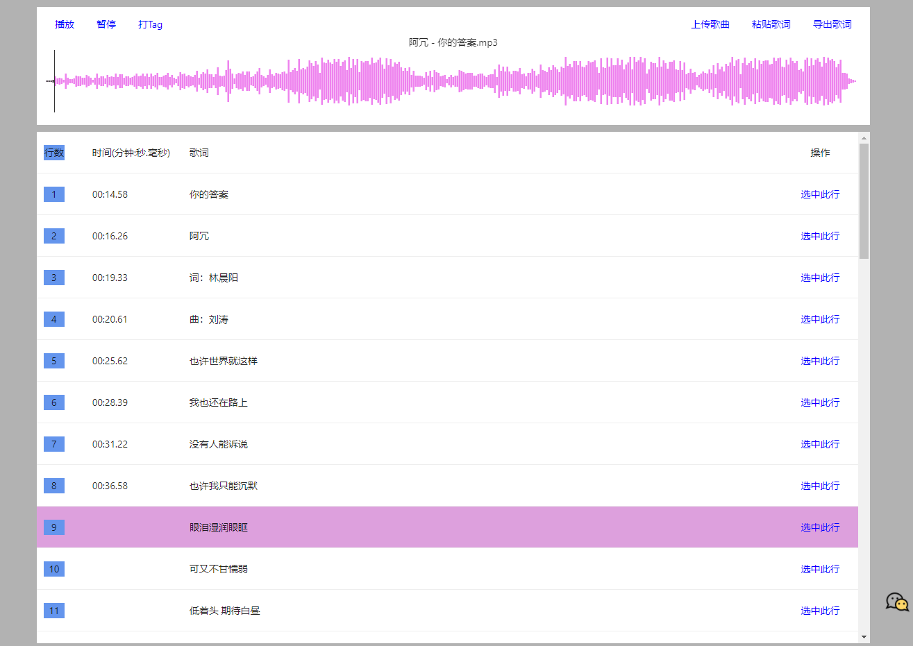

### 项目介绍

使用react开发的，在线歌词编辑工具，可以制作lrc格式歌词。

### 使用技术

前端使用react、antd、wavesurferjs等工具。后端使用阿里云oss静态网站托管。
### 网站地址

[lrc歌词在线制作网站](http://lrc.mfish.xyz/)

### 命令

开发 `yarn start | npm run start`

打包 `yarn build | npm run build`

### 页面截图

